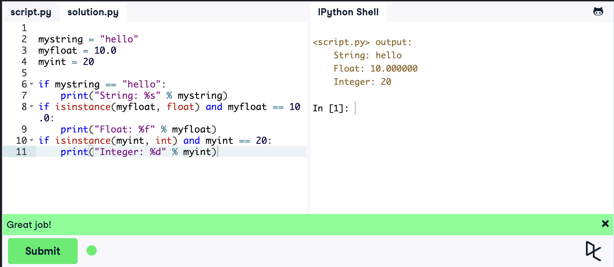
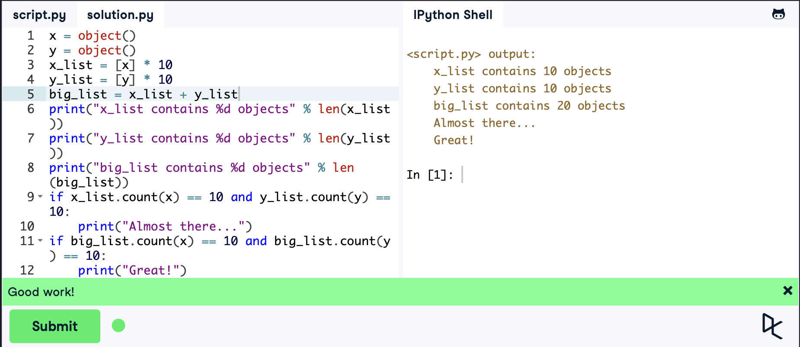
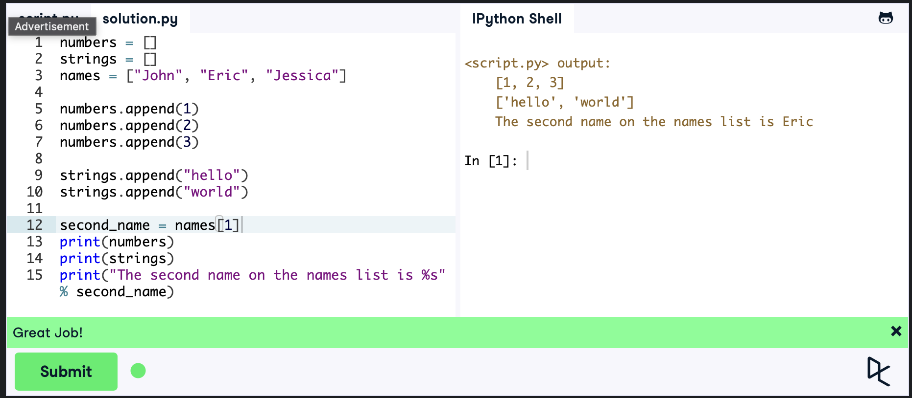
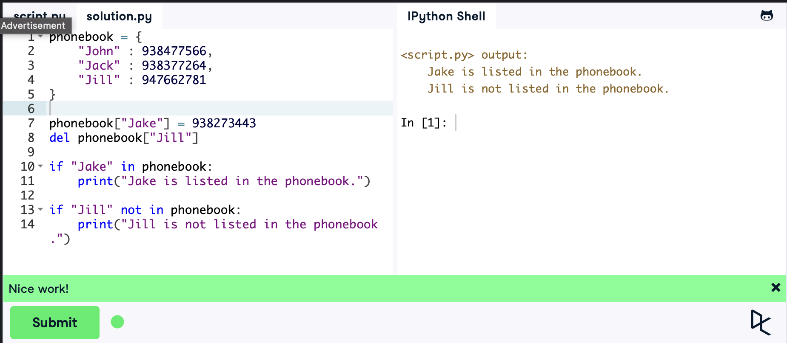

### Львівський національний університет ветеринарної медицини та біотехнологій імені С.З. Ґжицького

## Кафедра інформаційних технологій

# Звіт про виконання лабораторної роботи 

## Вивчення вбудованих типів даних і методів роботи з ними у Python 3"

*Виконала студентка групи КН-21 Кава Анастасія* 

*Прийняв доц. Андрій Татомир*

### Львів 2026

---

**Мета роботи** - вивчення основ розробки додатків на Python 3.

## Хід роботи :
1. *Робота зі змінними та типами даних*

    *Початкові значення None замінено на типи: string, float та int. Це робить правильну роботу та успішне виведення значень в консоль.*
    
    *Функція isinstance() - це вбудований інструмент для перевірки того, чи належить об'єкт до певного класу або типу даних.*

```python
mystring = "hello"
myfloat = 10.0
myint = 20

if mystring == "hello":
    print("String: %s" % mystring)
if isinstance(myfloat, float) and myfloat == 10.0:
    print("Float: %f" % myfloat)
if isinstance(myint, int) and myint == 20:
    print("Integer: %d" % myint)
```
*Результат:*


2. *Базові оператори зі списками*

    *Сформовано списки x_list та y_list по 10 елементів у кожному. Використано оператор для об'єднання їх у загальний список big_list, що показує роботу зі списками.*

```python
x = object()
y = object()

x_list = [x] * 10
y_list = [y] * 10
big_list = x_list + y_list

print("x_list contains %d objects" % len(x_list))
print("y_list contains %d objects" % len(y_list))
print("big_list contains %d objects" % len(big_list))

if x_list.count(x) == 10 and y_list.count(y) == 10:
    print("Almost there...")
if big_list.count(x) == 10 and big_list.count(y) == 10:
    print("Great!")
```

*Результат:*


3. *Робота зі списками (List)*

    *Вивчено структуру даних list. Списки numbers та strings було наповнено цілими числами та рядковими значеннями. Окрему увагу приділено індексації, доступ до другого елемента списку names реалізовано через індекс [1], оскільки індексація починається з нуля.*

````python
numbers = [1, 2, 3]
strings = ["hello", "world"]
names = ["John", "Eric", "Jessica"]
second_name = names[1]

print(numbers)
print(strings)
print("The second name on the names list is %s" % second_name)
````

*Результат:*


4. *Операції над рядками*

    *Сформовано рядок, що має в собі довжини та входження символів. Застосовано:*

    *Методи рядків: зміна регістру (upper, lower), розбиття рядка на список слів (split).*

    *Пошук: знаходження індексу першого входження символу та підрахунок загальної кількості входжень.*

    *Метод startswith() Перевіряє, чи починається рядок із вказаного префікса.*
    *Метод endswith() Перевіряє, чи закінчується рядок вказаним суфіксом*

````python
s = "Strings are awesome!"
print("Length of s = %d" % len(s))
print("The first occurrence of the letter a = %d" % s.index("a"))
print("a occurs %d times" % s.count("a"))
print("The first five characters are '%s'" % s[:5])
print("The next five characters are '%s'" % s[5:10]) 
print("The thirteenth character is '%s'" % s[12]) 
print("The characters with odd index are '%s'" %s[1::2]) 
print("The last five characters are '%s'" % s[-5:])
print("String in uppercase: %s" % s.upper())
print("String in lowercase: %s" % s.lower())

if s.startswith("Str"):
    print("String starts with 'Str'. Good!")

if s.endswith("ome!"):
    print("String ends with 'ome!'. Good!")

print("Split the words of the string: %s" % s.split(" "))
````
*Результат:*


5. *Робота зі словниками (Dict)*

    *Словник : "ключ-значення". В об'єкті phonebook було проведено заміну даних: видалено/замінено застарілий запис на актуальний ключ "Jake" з відповідним номером.*

````python
phonebook = {  
    "John" : 938477566,
    "Jack" : 938377264,
    "Jake" : 938273443
}  

if "Jake" in phonebook:  
    print("Jake is listed in the phonebook.")
    
if "Jill" not in phonebook:      
    print("Jill is not listed in the phonebook.")
````

Результат:


## *Висновки*
*Під час виконання лабораторної роботи було поглиблено знання Python. Закріплено навички роботи з базовими типами. На практиці було згадано: списки, рядки та словники.*