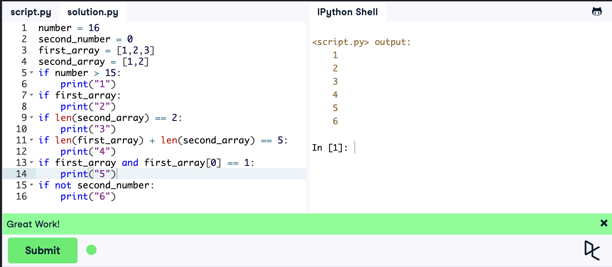
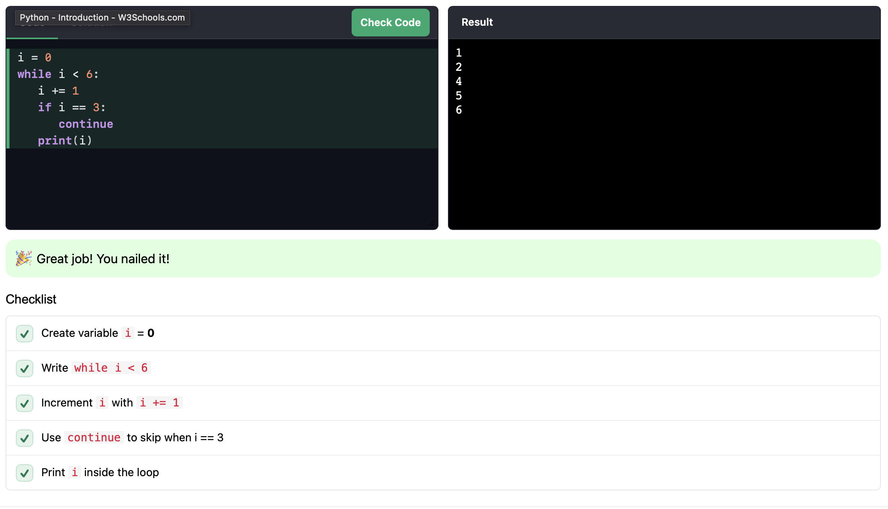
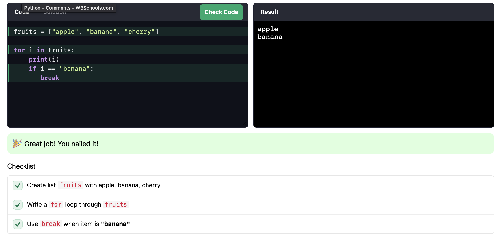

### Львівський національний університет ветеринарної медицини та біотехнологій імені С.З. Ґжицького

## Кафедра інформаційних технологій

# Звіт про виконання лабораторної роботи 

## На тему "Основи структурного програмування в Python 3"

*Виконала студентка групи КН-21 Кава Анастасія* 

*Прийняв доц. Андрій Татомир*

### Львів 2026

---

**Мета роботи** : ознайомлення основними прийомами структурного програмування у Python 3.

## Хід роботи

1. *Умовні оператори*

    *У цьому завданні я навчилася керувати програмою за допомогою перевірок. Щоб код вивів потрібні цифри (від 1 до 6), я підібрала значення змінних так, щоб усі умови if стали True*

```python
number = 16
second_number = None
first_array = [1,2,3]
second_array = [1,2]

if number > 15:
    print("1")

if first_array:
    print("2")

if len(second_array) == 2:
    print("3")

if len(first_array) + len(second_array) == 5:
    print("4")

if first_array and first_array[0] == 1:
    print("5")

if not second_number:
    print("6")
```

Результат:



2. *Цикл while та «стрибки» через ітерації*

    *Тут я розібралася, як змусити код повторюватися, поки виконується умова (поки i < 6).*

    *Головна фішка - оператор continue. Я налаштувала його так, коли цикл доходить до трійки, він не друкує її, а просто переступає назад на початок і йде далі до четвірки. Це зручно, коли треба проігнорувати якийсь конкретний випадок у черзі.*

```python
i = 0
while i < 6:
   i += 1
   if i == 3:
      continue
   print(i)
```

Результат:


### Посилання на [завдання](https://www.w3schools.com/python/python_challenges_while_loops.asp), яке було взято зі сайту.


3. *Цикл for та break*

    *На прикладі списку з фруктами я перевірила, як працює break. На різницю від continue, цей оператор не просто пропускає крок, а повністю цикл зупиняє і більше нічого не робить. Як тільки черга дійшла до банана, програма вимкнула цикл, навіть якщо там далі були ще фрукти.*

```python
fruits = ["apple", "banana", "cherry"]

for i in fruits:
    print(i)
    if i == "banana":
       break
```

Результат:


### Посилання на [завдання](https://www.w3schools.com/python/python_challenges_for_loops.asp) яке було взято зі сайту.
## Висновки
Після цієї лаборатоної я пригадала і закріпила знання використання циклів for (для фіксованих послідовностей) та while (для умовних циклів). Дізналася різницю між керуючими операторами break та continue.