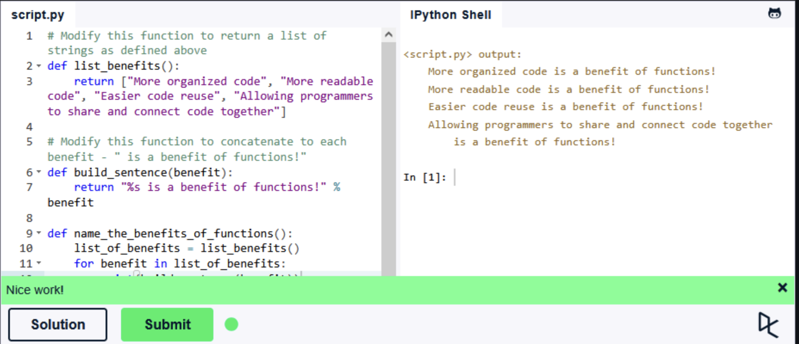

### Львівський національний університет ветеринарної медицини та біотехнологій імені С.З. Ґжицького

## Кафедра інформаційних технологій

# Звіт про виконання лабораторної роботи 

## На тему "Основи процедурного програмування в Python 3"

*Виконала студентка групи КН-21 Кава Анастасія* 

*Прийняв доц. Андрій Татомир*

### Львів 2026

---

**Мета роботи** - полягає у засвоєнні студентами методів та прийомів роботи з функціями.

## Хід роботи

1. *Оголошення функцій*

    *list_benefits(): Функція виступає джерелом даних. Вона не приймає аргументів, а лише повертає список* 
    *(list) із перевагами використання функцій у програмуванні.*
    *build_sentence(benefit): Функція для обробки рядків. Вона приймає один аргумент (конкретну перевагу) і формує речення, використовуючи оператор форматування %s.*

2. *Реалізація керуючої логіки*

    *Головна функція name_the_benefits_of_functions() напраляє роботу всього коду*
    *Спершу вона викликає list_benefits(), зберігаючи отриманий результат у власну змінну.*
    *Далі, за допомогою циклу for, вона проходить по кожному елементу списку.*
    *Для кожного елемента викликається функція build_sentence(), а результат виводиться на екран.*

```python
def list_benefits():
    return ["More organized code", "More readable code", "Easier code reuse", "Allowing programmers to share and connect code together"]

def build_sentence(benefit):
    return "%s is a benefit of functions!" % benefit

def name_the_benefits_of_functions():
    list_of_benefits = list_benefits()
    for benefit in list_of_benefits:
        print(build_sentence(benefit))
```

Результат:


## Висновки
 Закріпила логіку роботи функцій передачу аргументів та порівняла класичне форматування рядків через %s із сучасними f-рядками на прикладі розв’язаної задачі. 