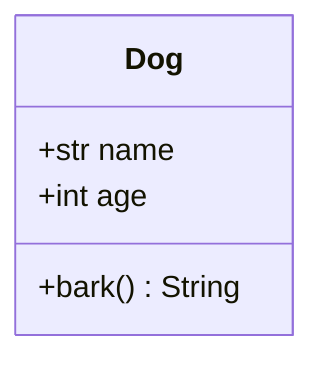

### Львівський національний університет ветеринарної медицини та біотехнологій імені С.З. Ґжицького

## Кафедра інформаційних технологій
# Звіт про виконання лабораторної роботи 

## На тему "Створення та використання класів"

*Виконала студентка групи КН-21 Кава Анастасія* 

*Прийняв доц. Андрій Татомир*

### Львів 2026

---

**Мета роботи** - ознайомитися з поняттями класів та об’єктів та закріпити на практиці методи їх створення та використання.

## Хід роботи

1. *Оголошення класу в [lab5](lab5.py)*
    *Створено клас Dog, який виступає "шаблоном" для майбутніх об'єктів.*

2. *Конструктор класу.*
     *Використано магічний метод __init__. Він автоматично спрацьовує при створенні собаки та ініціалізує її характеристики - ім'я (name) та вік (age).*

3. *об'єкт (self) і звернися до його змінної*
     *Через self.name та self.age дані зберігаються всередині конкретного об'єкта.*

4. *Методи*
    *Описано метод bark(), який дозволяє об'єкту виконувати дію — повертати текстове повідомлення "Woof!".*

5. *Створення об'єкта*
    *Створено об'єкт my_dog з конкретними параметрами ("Buddy", 3). Це виділяє пам'ять та заповнює її вказаними даними.*

6. *Візуалізація структури класу за допомогою UML-діаграми*
    *архітектура створеного класу була побудована UML-діаграму класів (Class Diagram) за допомогою інструменту Mermaid. Це дозволило графічно відобразити склад об'єкта*

 *Дані класу - name (тип str) та age (тип int), що зберігають стан об'єкта.*

*Методи класу - bark(), визначає поведінку об'єкта класа.*

## Висновки
У результаті виконання роботи я закріпила базові принципи ООП в Python. На практиці було закріплено навички створення класів та їхніх об'єктів.