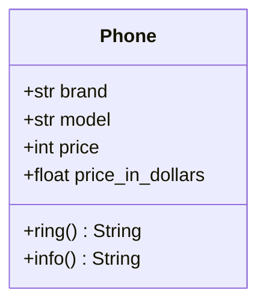

### Львівський національний університет ветеринарної медицини та біотехнологій імені С.З. Ґжицького

## Кафедра інформаційних технологій
# Звіт про виконання лабораторної роботи 

## На тему "Створення та використання класів"

*Виконала студентка групи КН-21 Кава Анастасія* 

*Прийняв доц. Андрій Татомир*

### Львів 2026

---

**Мета роботи** - ознайомитися з поняттями класів та об’єктів та закріпити на практиці методи їх створення та використання.

## Хід роботи

1.  *Оголошення класу* 
    
    *Створено клас Phone, який є шаблоном для наступних 2-х створених об'єктів.*

2.  *Конструктор та атрибути* 

     *Використано магічний метод **__ init__** для надання початкових значень : **brand**, **model** та **price** (ціна в гривнях).*

    *Також додано **price_in_dollars**, яка розраховується під час створення об'єкта - це ділення ціни на курс (42). Створений на основі інших атрибутів класа*

3.  *Створення методів*

    *Було створено 2 метода, перший це ring(), що через функцію задає звуковий сигнал телефона, а другий - info(), надає повну інформацію про опис заданих обʼєктові, що використовує всі атрибути.*

4.  *Виклик метода/класа*

    *Було викликано метод через обʼєкт phone1.info(). Спочатку йде виклик обʼєкта, а дальше назва метода, а щоб викликати через клас - спочатку використати назву класа, а потім назва метода, до якого ми хочемо звернутись, а в дужках вже назва потрібного обʼєкта.*
    
5. *Також було створено UML-діаграму класу, щоб наочно побачити структуру класу.*

## Висновки
У результаті виконання роботи я закріпила базові принципи ООП в Python. На практиці було закріплено навички створення класів та їхніх об'єктів.