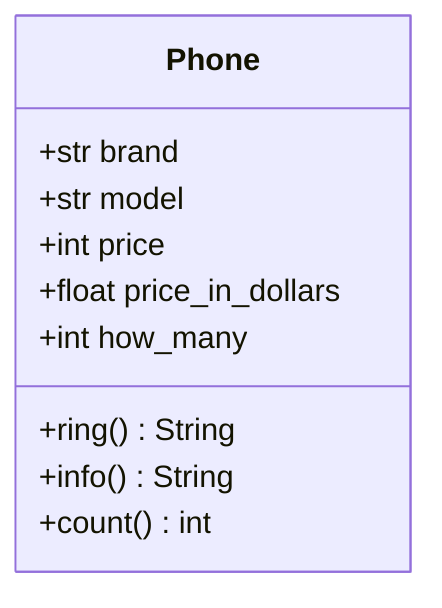

### Львівський національний університет ветеринарної медицини та біотехнологій імені С.З. Ґжицького

## Кафедра інформаційних технологій
# Звіт про виконання лабораторної роботи 

## На тему "Змінні класу та об’єкта"

*Виконала студентка групи КН-21 Кава Анастасія* 

*Прийняв доц. Андрій Татомир*

### Львів 2026

---

**Мета роботи** - Ознайомитися з різними типами змінних в об’єктно-орієнтованому програмуванні

1. *Були незначні зміни в [lab6](lab6.py). До класу Phone було додано змінну **how_many = 0**. Вона є **спільною для всіх об'єктів**, тому зберігається в пам'яті класу, а **не** кожного окремого екземпляра. В конструкторі __init__ створено **лічильник Phone.how_many += 1**. Це дозволяє автоматично рахувати кожен новий об'єкт, оскільки магічний метод __init__ викликається при кожному новому обʼєкті.*

2. *Використано декоратор @classmethod для методу count(). Це дозволяє методу звертатися до класу (Phone) для отримання змінних класу.*

3. *Також було створено UML-діаграму класу з новими змінами, щоб наочно побачити структуру класу.*

## Висновки
Навчилась використовувати змінні класу для створення лічильника, а також працювати з декоратором @classmethod та підраховувати кількість обʼєктів.