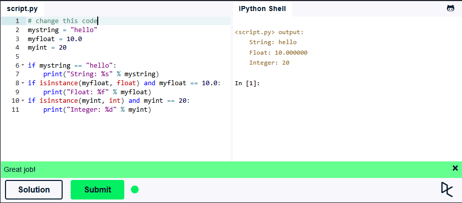
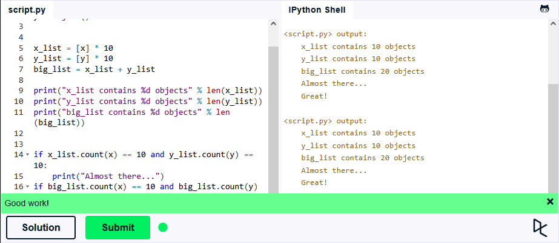
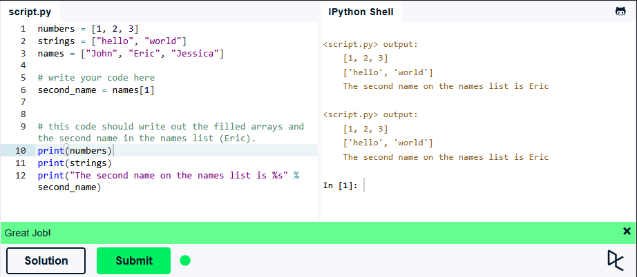
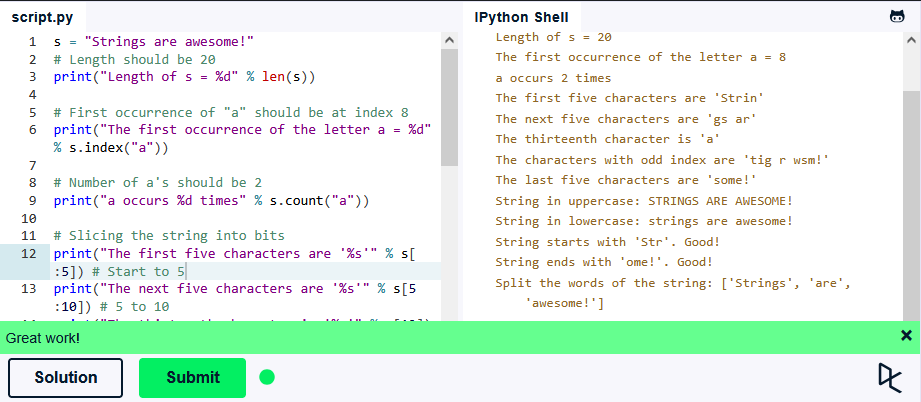
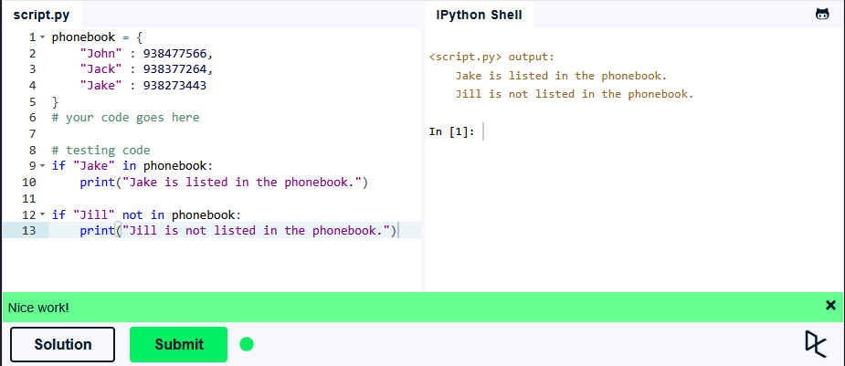

## Львівський національний університет ветеринарної медицини та біотехнологій імені С.З. Ґжицького

### Кафедра інформаційних технологій 

# Звіт про виконання лабораторної роботи №2
На тему: "Вивчення вбудованих типів даних і методів роботи з ними у Python 3"

Виконав студент групи КН-21 Кудла Данило

Прийняв доц. Андрій Татомир

### Львів 2026

---

**Мета роботи** – вивчення основ розробки додатків на Python 3.

## Хід роботи

1. У ході виконання завдання типів даних було замінено стан змінних, що на початку були None. Зроблено заміну на конкретні типи даних, що дозволило пройти перевірку в операторах if та вивести результат.
```python

mystring = "hello"
myfloat = 10.0
myint = 20

if mystring == "hello":
    print("String: %s" % mystring)
if isinstance(myfloat, float) and myfloat == 10.0:
    print("Float: %f" % myfloat)
if isinstance(myint, int) and myint == 20:
    print("Integer: %d" % myint)
```
Результат:



2. У виконанні роботи з базовими операціями у змінних **x_list** і **y_list** було створено списки, що містять по 10 елементів. Додано список **big_list**, який за допомогою оператора додавання(+) об'єднав ці два списки в один.
```python
x = object()
y = object()

x_list = [x] * 10
y_list = [y] * 10
big_list = x_list + y_list

print("x_list contains %d objects" % len(x_list))
print("y_list contains %d objects" % len(y_list))
print("big_list contains %d objects" % len(big_list))

if x_list.count(x) == 10 and y_list.count(y) == 10:
    print("Almost there...")
if big_list.count(x) == 10 and big_list.count(y) == 10:
    print("Great!")
```
Результат:



3. Для виконання завдання з типом **List** у списку **numbers** додано цифри **1, 2, 3**, а також для списку **string** додано **"hello"** і **"world"**. В змінні **second_name** було присвоєне значення другого елемента зі списку **names**. Це реалізовано через звернення до списку за індексом [1].
````python

numbers = [1, 2, 3]
strings = ["hello", "world"]
names = ["John", "Eric", "Jessica"]
second_name = names[1]

print(numbers)
print(strings)
print("The second name on the names list is %s" % second_name)
````

Результат:



4. У ході виконання роботи зі стрічками створено рядок **s** з довжиною 20 символів. Вміст підібрано так, щоб перша літера **"a"** знаходилась на 8 індексі та їх кількість дорівнювала двом.
````python

s = "Strings are awesome!"
print("Length of s = %d" % len(s))
print("The first occurrence of the letter a = %d" % s.index("a"))
print("a occurs %d times" % s.count("a"))
print("The first five characters are '%s'" % s[:5])
print("The next five characters are '%s'" % s[5:10]) 
print("The thirteenth character is '%s'" % s[12]) 
print("The characters with odd index are '%s'" %s[1::2]) 
print("The last five characters are '%s'" % s[-5:])
print("String in uppercase: %s" % s.upper())
print("String in lowercase: %s" % s.lower())

if s.startswith("Str"):
    print("String starts with 'Str'. Good!")

if s.endswith("ome!"):
    print("String ends with 'ome!'. Good!")

print("Split the words of the string: %s" % s.split(" "))
````
Результат:



5. У ході виконання завдання зі словником змінено ключ **"Jill"** на ключ **"Jake"**, а також було змінено значення номеру телефону з **947662781** на **938273443**. Це дозволило пройти всі перевірки через оператори if.
````python

phonebook = {  
    "John" : 938477566,
    "Jack" : 938377264,
    "Jake" : 938273443
}  

if "Jake" in phonebook:  
    print("Jake is listed in the phonebook.")
    
if "Jill" not in phonebook:      
    print("Jill is not listed in the phonebook.")
````

Результат:



## Висновки
У підсумку виконання лабораторної роботи закріплено основи синтаксису в Python 3. Ознайомився з типом даних complex. На практиці застосовано поняття динамічної типізації та роботу з основними операторами.
