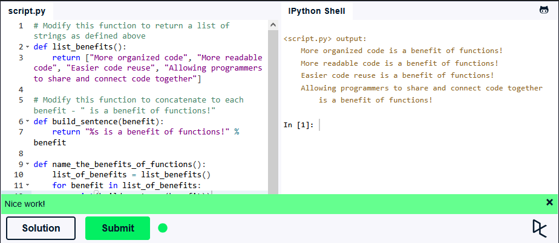

## Львівський національний університет ветеринарної медицини та біотехнологій імені С.З. Ґжицького

### Кафедра інформаційних технологій

# Звіт про виконання лабораторної роботи №4
На тему: "Основи процедурного програмування в Python 3"

Виконав студент групи КН-21 Кудла Данило

Прийняв доц. Андрій Татомир

### Львів 2026

---

**Мета роботи** - полягає у засвоєнні студентами методів та прийомів роботи з функціями.

## Хід роботи

1. У ході завдання створено дві функції: перша **list_benefits** повертає готовий список, а друга функція **build_sentence** приймає аргумент із першої та за допомогою оператора %s формує повне речення.
```python
def list_benefits():
    return ["More organized code", "More readable code", "Easier code reuse", "Allowing programmers to share and connect code together"]

def build_sentence(benefit):
    return "%s is a benefit of functions!" % benefit

def name_the_benefits_of_functions():
    list_of_benefits = list_benefits()
    for benefit in list_of_benefits:
        print(build_sentence(benefit))
```

Результат:



## Висновок
У підсумку виконаної роботи закріплено синтаксис функцій в Python 3. Закріплено поняття параметрів та аргументів функції. Дізнався про оператор **%s**: він використовується у старіших версіях Python, а зараз його аналогом є **f-рядок**. Розв'язано заданий приклад по роботі з функціями. 