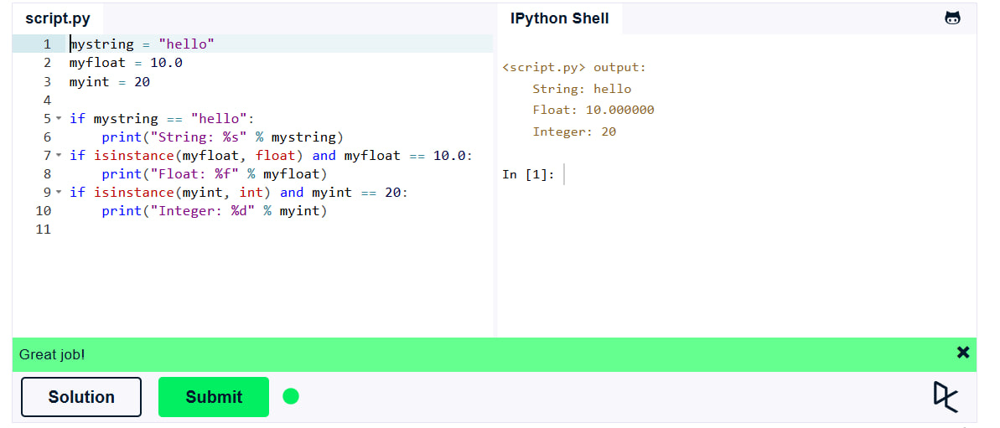
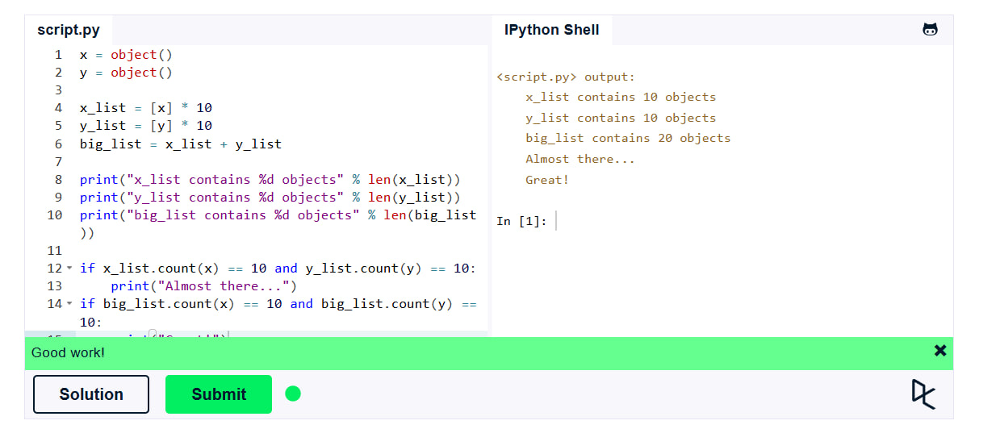
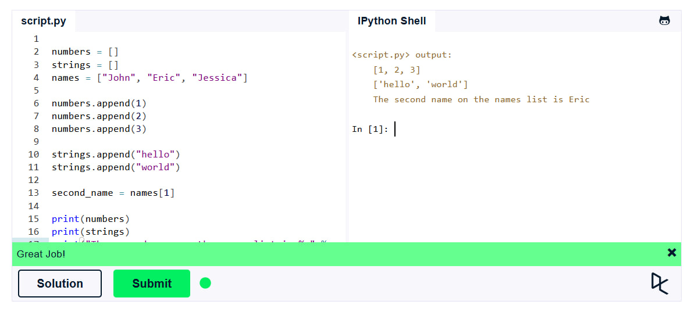
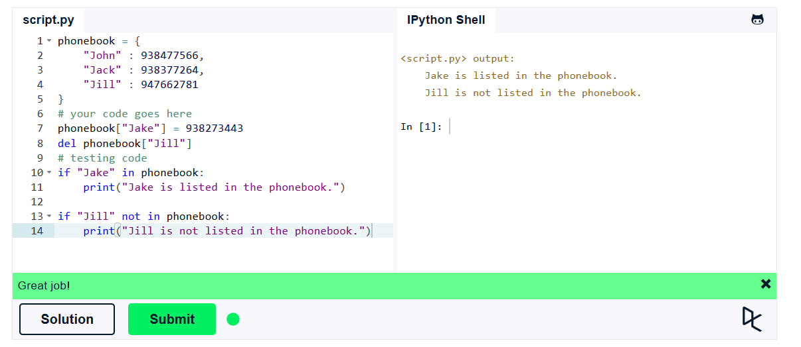
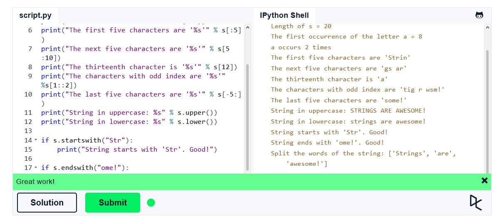

Львівський національний університет ветеринарної медицини та біотехнологій імені С.З. Ґжицького  
Кафедра інформаційних технологій

# Звіт про виконання лабораторної роботи №2

**На тему:** "Вивчення вбудованих типів даних і методів роботи з ними у Python 3"  
**Виконав:** студент групи КН-21 Сокирко Мар'ян  
**Прийняв:** доц. Андрій Татомир  
**Львів 2026**

---

**Мета роботи:** вивчення основ розробки простих застосунків на Python 3.

---

## Хід роботи

### 1. Засвоїв поняття змінних в python 3 та їх прості типи:
Код:
```python
mystring = "hello"
myfloat = 10.0
myint = 20

if mystring == "hello":
    print("String: %s" % mystring)
if isinstance(myfloat, float) and myfloat == 10.0:
    print("Float: %f" % myfloat)
if isinstance(myint, int) and myint == 20:
    print("Integer: %d" % myint)
```

Результат:



### 2. Навчився здійснювати базові операції та приводити типи:
**Код:**
```python
x = object()
y = object()

x_list = [x] * 10
y_list = [y] * 10
big_list = x_list + y_list

print("x_list contains %d objects" % len(x_list))
print("y_list contains %d objects" % len(y_list))
print("big_list contains %d objects" % len(big_list))

if x_list.count(x) == 10 and y_list.count(y) == 10:
    print("Almost there...")
if big_list.count(x) == 10 and big_list.count(y) == 10:
    print("Great!")
```

**Результат:**



### 3. Освоїв роботу зі стрічками як зі списками (“Lists”):
**Код:**

```python
numbers = []
strings = []
names = ["John", "Eric", "Jessica"]

numbers.append(1)
numbers.append(2)
numbers.append(3)

strings.append("hello")
strings.append("world")

second_name = names[1]

print(numbers)
print(strings)
print("The second name on the names list is %s" % second_name)
```

**Результат:**



### 4. Ознайомився з типом даних “словник” (“Dictionary”):
**Код:**

```python
phonebook = {  
    "John" : 938477566,
    "Jack" : 938377264,
    "Jill" : 947662781
}  
phonebook["Jake"] = 938273443
del phonebook["Jill"]
if "Jake" in phonebook:  
    print("Jake is listed in the phonebook.")
    
if "Jill" not in phonebook:      
    print("Jill is not listed in the phonebook.")
```

**Результат:**



### 5. Ознайомився з основними операціями над рядками:
**Код:**

```python
s = "Strings are awesome!"
print("Length of s = %d" % len(s))
print("The first occurrence of the letter a = %d" % s.index("a"))
print("a occurs %d times" % s.count("a"))
print("The first five characters are '%s'" % s[:5])
print("The next five characters are '%s'" % s[5:10]) 
print("The thirteenth character is '%s'" % s[12]) 
print("The characters with odd index are '%s'" %s[1::2]) 
print("The last five characters are '%s'" % s[-5:])
print("String in uppercase: %s" % s.upper())
print("String in lowercase: %s" % s.lower())

if s.startswith("Str"):
    print("String starts with 'Str'. Good!")

if s.endswith("ome!"):
    print("String ends with 'ome!'. Good!")

print("Split the words of the string: %s" % s.split(" "))
```

**Результат:**




### Висновки:

Під час виконання лабораторної роботи я ознайомився з базовим синтаксисом Python 3. Я навчився працювати зі змінними, різними типами даних (числа, рядки, списки), а також опанував основні операції над ними. 