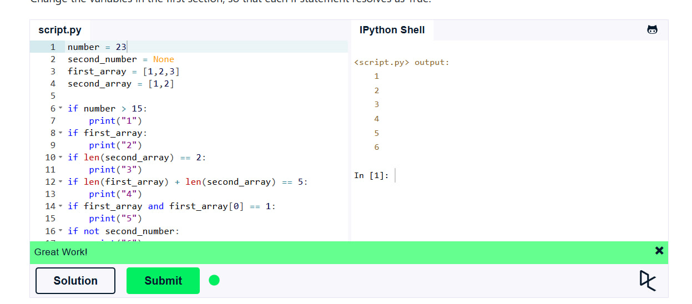
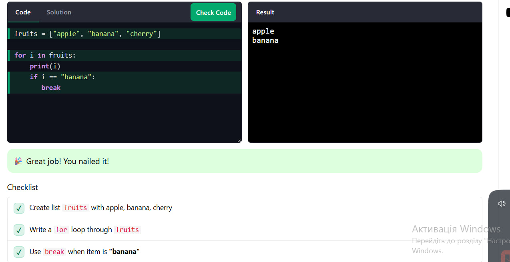
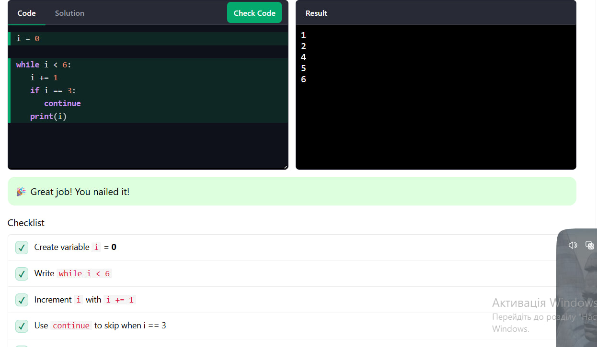

## Львівський національний університет ветеринарної медицини та біотехнологій імені С.З. Ґжицького

### Кафедра інформаційних технологій 

# Звіт про виконання лабораторної роботи №3
На тему: "Основи структурного програмування в Python 3"

Виконав студент групи КН-21 Сокирко Мар'ян

Прийняв доц. Андрій Татомир

### Львів 2026

---

**Мета роботи** – ознайомлення основними прийомами структурного
програмування у Python 3.

## Хід роботи

### 1. Під час виконання даної лабораторної роботи я ознайомився з умовним оператором *if*

Код:

```python

number = 23
second_number = None
first_array = [1,2,3]
second_array = [1,2]

if number > 15:
    print("1")
if first_array:
    print("2")
if len(second_array) == 2:
    print("3")
if len(first_array) + len(second_array) == 5:
    print("4")
if first_array and first_array[0] == 1:
    print("5")
if not second_number:
    print("6")
```

Результат:



### 2. Засвоїв роботу з циклом *for* (завдання взяв з сайту W3Schools)

Код:

```python

fruits = ["apple", "banana", "cherry"]

for fruit in fruits:
    print(fruit)
    if fruit == "banana":
        break

```

Результат:



### 3. Також ознайомився з циклом *while* (завдання було взято з сайту W3Schools), вивчив його особливість виконувати блок коду доти, доки визначена умова залишається істинною (true).

Код:
```python

i = 0

while i < 6:
   i += 1
   if i == 3:
      continue
   print(i)


```

Результат:




### Висновки:

Під час лабораторної роботи я навчився працювати з умовними операторами *if* та *else*. Також ознайомився з циклами *for* та *while*.