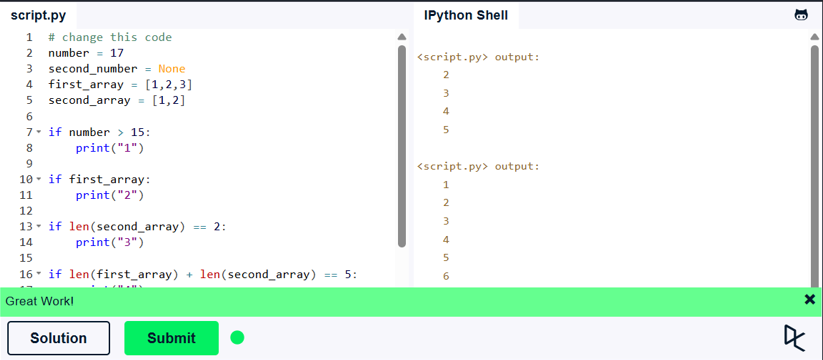
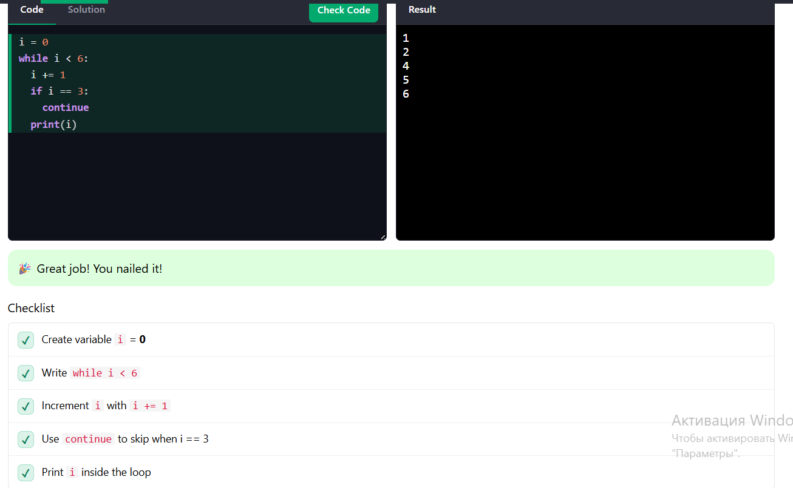
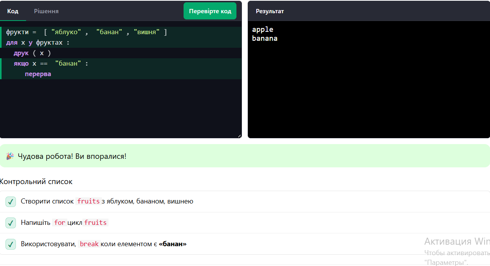

**Львівський національний університет ветеринарної медицини та біотехнологій імені С.З. Ґжицького**

**Кафедра інформаційних технологій**

# Звіт про виконання лабораторної роботи №3
На тему 
"Основи структурного програмування в Python 3"

Виконала студентка групи Кн-21 Вечера Надія

Прийняв доц. Андрій Татомир

### Львів 2026

---

**Мета роботи** - ознайомлення основними прийомами структурного 
програмування у Python 3.

## Хід роботи

1. **Умовні оператори:**
```python
number = 17
second_number = None
first_array = [1,2,3]
second_array = [1,2]

if number > 15:
    print("1")

if first_array:
    print("2")

if len(second_array) == 2:
    print("3")

if len(first_array) + len(second_array) == 5:
    print("4")

if first_array and first_array[0] == 1:
    print("5")
```
**Результат:**



2. **Цикл while:**

Завдання для роботи взято [на цьому сайті](https://www.w3schools.com/)

Умови завдання:
1. Створіть змінну **i** зі значенням **0**
2. Напишіть **while** цикл, який виконується доти, доки **i** значення менше 6.
3. Всередині циклу: збільшіть **i** на 1
4. Якщо **i** дорівнює 3 , використовуйте **continue**, щоб пропустити цю ітерацію
5. Друк **i**

Саме [Завдання](https://www.w3schools.com/python/python_challenges_while_loops.asp)
**Результат**


3. **Цикл for:**

Умови завдання:
1. Створіть список **fruits** з назвами: "яблуко" , "банан" , "вишня"
2. Напишіть цикл **for**, який виводить кожен елемент у **fruits**
3. Використайте **break** для зупинки циклу, коли елемент має тип "банан"

Саме [Завдання](https://www.w3schools.com/python/python_challenges_for_loops.asp)
**Результат**



### Висновок
У цій роботі трохи важкувато було з циклом While та з умовними операторами. Цей сайт на якому я працювала порадила викладчка,мені сподобалось на ньому працювати. Треба ще попрацювати з циклами для кращого розуміння.