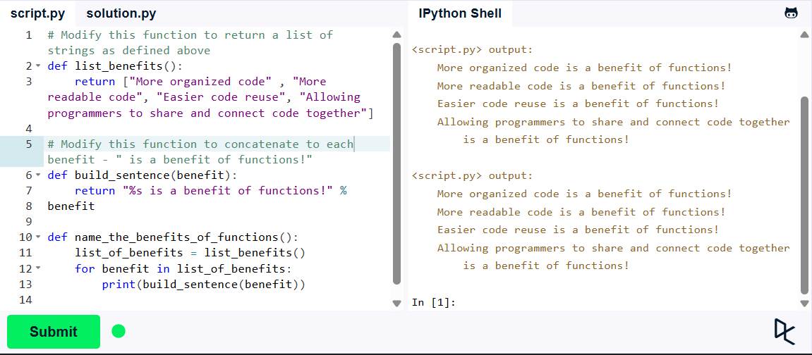

**Львівський національний університет ветеринарної медицини та біотехнологій імені С.З. Ґжицького**

**Кафедра інформаційних технологій**

# Звіт про виконання лабораторної роботи №4

На тему 
"Основи процедурного програмування в Python 3"

Виконала студентка групи Кн-21 Вечера Надія

Прийняв доц. Андрій Татомир

### Львів 2026

---

**Мета роботи** - Мета роботи полягає у засвоєнні методів та прийомів роботи з функціями.

# Хід роботи

У ході завдання потрібно було використати вже існуючу функцію, а також додати власну,щоб створити повнофункціональну програму.

1. Додати функцію з назвою **list_benefits()**, яка повертає наступний список рядків: **"More organized code", "More readable code", "Easier code reuse", "Allowing programmers to share and connect code together"**

2. Додати функцію з назвою **build_sentence(info)**, яка отримує один аргумент, що містить рядок, і повертає речення, що починається з заданого рядка та закінчується рядком **"is a benefit of functions!"**.

**Результат**

**Висновок:** У ході роботи я закріпила поняття параметрів та аргументів функцій, вивчила методи роботи з функціями, а також виконала роботу.